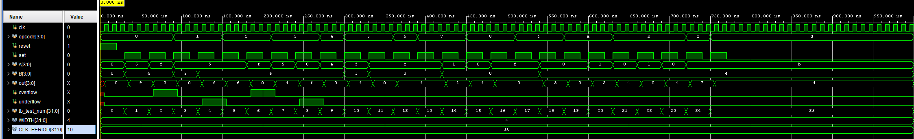

# Scalable-Unsigned-ALU
This project features a scalable unsigned Arithmetic Logic Unit (ALU) in SystemVerilog, parameterized by bit width (WIDTH). It supports common arithmetic, logical, shift, and rotate operations, with overflow and underflow detection. Verified using a modular, reusable SystemVerilog testbench in Vivado.

